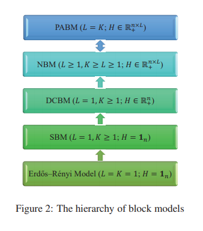

```{r setup, include=FALSE}
knitr::opts_chunk$set(echo = FALSE, 
                      comment = NA, 
                      warning = FALSE, 
                      message = FALSE,
                      fig.align = 'center',
                      fig.lp = '')
options(xtable.comment = FALSE, 
        xtable.table.placement = 'H')
library(ggplot2)
import::from(magrittr, `%>%`)
theme_set(theme_bw())

source('~/dev/pabm-grdpg/functions.R')
set.seed(314159)
```

## Overview

* Preliminaries
  * Block Models and Community Detection
  * (Generalized) Random Dot Product Graphs
  * Connecting Block Models to the (G)RDPG
* The Popularity Adjusted Block Model
  * Connecting the PABM to the GRDPG
  * Subspace Clustering
* Community Detection for the (G)RDPG

# Preliminaries

## Bernoulli Graphs

<style type="text/css">
.caption {
    font-size: x-small;
}
</style>

$A \sim BernoulliGraph(P)$ iff:

* $G = (V, E)$
  * Undirected, unweighted, no self-loops
  * $|V| = n$
  * $|E| \leq n (n - 1) / 2$
* Adjacency matrix $A \in \{0, 1\}^{n \times n}$
  * $A_{ij} = \begin{cases} 
  1 & \exists \text{ edge between } i \text{ and } j \\
  0 & \text{else}
  \end{cases}$
* Edge probability matrix $P \in [0, 1]^{n \times n}$
* $A_{ij} \stackrel{indep}{\sim} Bernoulli(P_{ij})$ for $i < j$

```{r, fig.height = 1, fig.width = 2}
n <- 2 ** 5
p <- 1 / log(n)
P <- matrix(p, nrow = n, ncol = n)
A <- draw.graph(P)
qgraph::qgraph(A, vsize = 4)
```

## Block Models

* $A \sim BernoulliGraph(P)$
  * (Hidden) labels $z_1, ..., z_n \in [K]$
  * $P_{ij} = f(z_i, z_j, \cdot)$

* Example: Stochastic Block Model with two communities
    * $K = 2$
  * $P_{ij} = \begin{cases} 
  p & z_i = z_j = 1 \\
  q & z_i = z_j = 2 \\
  r & z_i \neq z_j
  \end{cases}$

```{r, fig.height = 1.5, fig.width = 4}
n1 <- 2 ** 5
n2 <- 2 ** 5
n <- n1 + n2
z <- c(rep(1, n1), rep(2, n2))
p <- 1/2
q <- 1/4
r <- 1/8
P <- matrix(r, nrow = n, ncol = n)
P[seq(n1), seq(n1)] <- p
P[seq(n1 + 1, n), seq(n1 + 1, n)] <- q
A <- draw.graph(P)
qgraph::qgraph(A, vsize = 4, groups = factor(z))
```
  
## Block Models

* Erdos-Renyi Model (1959)
  * $P_{ij} = \theta$
  * Not a block model
* Stochastic Block Model (Lorrain and White, 1971)
  * $P_{ij} = \theta_{z_i z_j}$
  * $K (K + 1) / 2$ parameters $\theta_{kl}$
* Degree Corrected Block Model (Karrer and Newman, 2011)
  * $P_{ij} = \theta_{z_i z_j} \omega_i \omega_j$
  * $K (K + 1) / 2 + n$ parameters $\theta_{kl}$, $\omega_i$
* Popularity Adjusted Block Model (Sengupta and Chen, 2017)
  * $P_{ij} = \lambda_{i z_j} \lambda_{j z_i}$
  * $K n$ parameters $\lambda_{ik}$
  
## Heirarchy of Block Models

* PABM $\to$ DCBM: $\lambda_{ik} = \sqrt{\theta_{z_i k}} \omega_i$
* DCBM $\to$ SBM: $\omega_i = 1$
* SBM $\to$ Erdos-Renyi: $\theta_{kl} = \theta$

\begin{center}
```{r, out.width = '150px'}

```

\tiny{Majid Noroozi and Marianna Pensky. "The Heirarchy of Block Models". March 2021.}
\end{center}

## Community Detection in Block Models

Likelihood

$$L = \prod_{i<j} \prod_{k, l}^K 
\big(p_{k, l, i, j}^{A_{ij}} 
(1 - p_{k, l, i, j})^{1 - A_{ij}} \big)^{z_{ik} z_{jl}}$$

* Example: DCBM ($p_{k, l, i, j} = \theta_{kl} \omega_i \omega_j$)

$$L = \prod_{i<j} \prod_{k, l}^K 
\big((\theta_{kl} \omega_i \omega_j)^{A_{ij}} 
(1 - \theta_{kl} \omega_i \omega_j)^{1 - A_{ij}} \big)^{z_{ik} z_{jl}}$$

* ML method for community detection: $\hat{\vec{z}} = \arg\max_{\vec{z}} L$

* NP-complete
  * Expectation-Maximization
  * Bayesian methods
  * **Spectral methods**

## (Generalized) Random Dot Product Graph Model

* Random Dot Product Graph $A \sim RDPG(X)$
  * Latent vectors $x_1, ..., x_n \in \mathcal{X} \subset \mathbb{R}^d$
    * $\mathcal{X} = \{x, y : 0 \leq x^\top y \leq 1\}$
  * Data matrix $X = \begin{bmatrix} x_1 & \cdots & x_n \end{bmatrix}^\top$
  * Edge probability matrix $P = X X^\top$
  * Adjacency matrix $A \sim BernoulliGraph(P)$

* Generalized Random Dot Product Graph $A \sim GRDPG_{p, q}(X)$
  * Latent vectors $x_1, ..., x_n \in \mathcal{X} \subset \mathbb{R}^d$
    * $\mathcal{X} = \{x, y : 0 \leq x^\top I_{p, q} y \leq 1\}$
    * $I_{p, q} = blockdiag(I_p, -I_q)$
    * $p + q = d$
  * Data matrix $X = \begin{bmatrix} x_1 & \cdots & x_n \end{bmatrix}^\top$
  * Edge probability matrix $P = X I_{pq} X^\top$
  * Adjacency matrix $A \sim BernoulliGraph(P)$

* If $X_1, ..., X_n \stackrel{iid}{\sim} F$, then $(A, X) \sim RDPG(F, n)$ or 
$(A, X) \sim GRDPG_{p, q}(F, n)$

## (Generalized) Random Dot Product Graph Model

### Recovery/Estimation

* Want to estimate $X$ given $A$
  * Alternatively, recover some property of $X$ given $A$ 
    * Interpoint distances
    * Inner products
    * Angles

* Adjacency Spectral Embedding
  * Given embedding dimension $d$, 
  $A \approx \hat{V} \hat{\Lambda} \hat{V}^\top$
    * If RDPG, use $d$ greatest eigenvalues
    * If GRDPG, use $p$ most positive and $q$ most negative eigenvalues
    * $\hat{V} \in \mathbb{R}^{n \times d}$
    * $\hat{\Lambda} \in \mathbb{R}^{d \times d}$
  * RDPG: $\hat{X} = \hat{V} \hat{\Lambda}^{1/2}$
  * GRDPG: $\hat{X} = \hat{V} |\hat{\Lambda}|^{1/2}$

* RDPG: $\max\limits_i \|\hat{X}_i - W_n X_i \| \stackrel{a.s.}{\to} 0$
(Athreya et al.)
* GRDPG: 
$\max\limits_i \|\hat{X}_i - Q_n X_i \| \stackrel{a.s.}{\to} 0$
(Rubin-Delanchy et al.)

## Connecting Block Models to the (G)RDPG Model

* All $G$ with $A \sim BernoulliGraph(P)$ are RDPG (if $P$ is 
positive semidefinite) or GRDPG
  * Includes all block models

* Example: SBM

$$X = \begin{bmatrix} 
\sqrt{p} & 0 \\
\vdots & \vdots \\
\sqrt{p} & 0 \\
\sqrt{r^2 / p} & \sqrt{q - r^2 / p} \\
\vdots & \vdots \\
\sqrt{r^2 / p} & \sqrt{q - r^2 / p}
\end{bmatrix}$$

$$P = X X^\top$$

## Connecting Block Models to the (G)RDPG Model

Example: SBM (cont'd)

* $A \sim BernoulliGraph(X X^\top)$
* $A \approx \hat{X} \hat{X}^\top$
  * $\hat{X} = \hat{V} \hat{\Lambda}^{1/2}$
* Apply clustering algorithm (e.g., $K$-means) on $\hat{X}$

```{r, fig.height = 8, fig.width = 8, out.width = '50%'}
A.eigen <- eigen(A)
X.hat <- A.eigen$vectors[, 1:2] %*% diag(A.eigen$values[1:2] ** .5)
plot(X.hat, asp = 1, col = z, xlab = NA, ylab = NA)
```

## Connecting Block Models to the (G)RDPG Model

```{r, out.width = '20%', fig.height = 2.5, fig.width = 2.5}
par(mar = rep(1.75, 4))
P.eigen = eigen(P)
X <- P.eigen$vectors[, 1:2] %*% diag(P.eigen$values[1:2] ** .5)
plot(X, asp = 1, col = z, xlab = NA, ylab = NA, main = 'SBM: Point masses')
```

```{r, out.width = '20%', fig.height = 2.5, fig.width = 2.5}
par(mar = rep(1.75, 4))
omega <- rbeta(n, 1, 1)
dc.matrix <- omega %*% t(omega)
P.dcbm <- P * dc.matrix
dcbm.eigen <- eigen(P.dcbm)
X.dcbm <- dcbm.eigen$vectors[, 1:2] %*% diag(dcbm.eigen$values[1:2] ** .5)
plot(X.dcbm, asp = 1, col = z, xlab = NA, ylab = NA, main = 'DCBM: Rays')

```

```{r, out.width = '33%', fig.height = 4, fig.width = 4}
par(mar = rep(1.75, 4))
Pz <- generate.P.beta(n)
P <- Pz$P
z <- Pz$clustering
X <- embedding(P)
pairs(X, col = z, asp = 1, pch = '.', main = 'PABM: Subspaces')
```

# Popularity Adjusted Block Model

## Popularity Adjusted Block Model (Reparameterization)

$A \sim PABM(\{\lambda^{(kl)}\}_K)$ iff 

* w.l.o.g., organize $P$ such that each block 
$P^{(kl)} \in [0, 1]^{n_k \times n_l}$ contains edge 
probabilities between communities $k$ and $l$
* Popularity vectors $\lambda^{(kl)} \in \mathbb{R}^{n_k}$ 
are the popularity parameters of members of community $k$ to community $l$
* $\{\lambda^{(kl)}\}_K$ is the set of $K^2$ popularity vectors
* $P^{(kl)} = \lambda^{(kl)} (\lambda^{(lk)})^\top$
* $A \sim BernoulliGraph(P)$

## Connecting the PABM to the GRDPG ($K = 2$)

Theorem: $A \sim PABM(\{\lambda^{(kl)}\}_2)$ is equivalent to 
$A \sim GRDPG_{3, 1}(X U)$ for $X$ constructed from $\{\lambda^{(kl)}\}_2$ and 
$U \in \mathbb{O}(4)$

Proof:

$$X = \begin{bmatrix}
\lambda^{(11)} & \lambda^{(12)} & 0 & 0 \\
0 & 0 & \lambda^{(21)} & \lambda^{(22)}
\end{bmatrix}$$

$$Y = \begin{bmatrix}
\lambda^{(11)} & 0 & \lambda^{(12)} & 0 \\
0 & \lambda^{(21)} & 0 & \lambda^{(22)}
\end{bmatrix}$$

$$P = X Y^\top$$

## Connecting the PABM to the GRDPG ($K = 2$)

Proof (cont'd):

$$Y = X \Pi$$

$$\Pi = \begin{bmatrix} 
1 & 0 & 0 & 0 \\ 
0 & 0 & 1 & 0 \\
0 & 1 & 0 & 0 \\
0 & 0 & 0 & 1
\end{bmatrix} = 
U I_{3, 1} U^\top$$

$$U = \begin{bmatrix}
1 & 0 & 0 & 0 \\
0 & 0 & 1 / \sqrt{2} & 1 / \sqrt{2} \\
0 & 0 & 1 / \sqrt{2} & -1 / \sqrt{2} \\
0 & 1 & 0 & 0
\end{bmatrix}$$

$$P = (X U) I_{3, 1} (X U)^\top$$

## Connecting the PABM to the GRDPG

**Theorem**: $A \sim PABM(\{\lambda^{(kl)}\}_K)$ is equivalent to 
$A \sim GRDPG_{p, q}(X U)$ such that

* $p = K (K + 1) / 2$
* $q = K (K - 1) / 2$
* $U$ is orthogonal
* $X$ is block diagonal

* Non-uniqueness: 
$A \sim GRDPG_{p, q}(X U) \implies A \sim GRDPG_{p, q}(X U Q)$ for 
$Q \in \mathbb{O}(p, q)$

## Orthogonal Spectral Clustering

**Theorem**: If $P = V \Lambda V^\top$ and $B = n V V^\top$, then $B_{ij} = 0$ 
$\forall i, j$ in different communities.

Orthogonalized Spectral Clustering algorithm: 

* Input: Adjacency matrix $A$, number of communities $K$
* Output: Community assignments $1, ..., K$

1. Compute the eigenvectors of $A$ that correspond to the $K (K+1)/2$ most 
positive and $K (K-1) / 2$ most negative eigenvalues to construct $V$.
2. Compute $B = |n V V^\top|$ applying $|\cdot|$ entry-wise.
3. Construct graph $G$ using $B$ as its similarity matrix.
4. Partition $G$ into $K$ disconnected subgraphs (e.g., using edge thresholding 
or spectral clustering).
5. Map each partition to the community labels $1, ..., K$.

## Orthogonal Spectral Clustering

**Theorem**: Let $\hat{B}_n$ with entries $\hat{B}_n^{(ij)}$ be the affinity 
matrix from OSC. 
Then $\forall$ pairs $(i, j)$ belonging to different communities 
and sparsity factor satisfying $n \rho_n = \omega\{(\log n)^{4c}\}$, 

$$
\max_{i, j} \hat{B}^{(ij)} = 
O_P \Big( \frac{(\log n)^c}{\sqrt{n \rho_n}} \Big)
$$

## Sparse Subspace Clustering

* $X$ is block diagonal and $U$ is orthogonal $\implies$ each community 
corresponds to a subspace in $\mathbb{R}^d$.
* Subspace property holds even with linear transformation 
$Q \in \mathbb{O}(p, q)$.
* If $P = V \Lambda V^\top$, then $V$ consists of *orthogonal* subspaces.

Sparse Subspace Clustering algorithm:

1. Solve $n$ optimization problems $c_i = \arg\min_c \|c\|_1$ 
subject to $x_i = X_{-i} c$ and $c_i^{(i)} = 0$.
2. Compile solutions $C = \begin{bmatrix} c_1 & \cdots & c_n \end{bmatrix}$
3. Construct affinity matrix $B = |C| + C^\top|$

* If $X$ obeys the Subspace Detection Property, then $B$ is sparse such that 
$B_{ij} = 0$ if $i$ and $j$ belong to different communities and $\|c_i\| > 0$.
* Step (1) of SSC typically performed via LASSO: 
$c_i = \arg\min \frac{1}{2} \|x_i - X_{-i} c\|_2^2 + \lambda \|c\|_1$

## Sparse Subspace Clustering

**Theorem**: 

Let 

* $P_n$ describe the edge probability matrix of the PABM with 
$n$ vertices
* $A_n \sim BernoulliGraph(P_n)$
* $\hat{V}_n$ be the matrix of eigenvectors of $A_n$ corresponding to the 
$K (K + 1) / 2$ most positive and $K (K - 1) / 2$ most negative eigenvalues. 

Then 

* $\exists \lambda > 0$ and $N < \infty$ such that when $n > N$, 
$\sqrt{n} \hat{V}_n$ obeys the Subspace Detection Property with probability 1.

Remarks:

* For large $n$, we can identify $\lambda$ for SDP (Wang and Xu, 2016).
* SDP does not guarantee community detection.

# General Community Detection for the (G)RDPG

## Generative Model

Let $(A, X) \sim RDPG(F, n)$ such that

1. Define functions $f_1, ..., f_K$ such that 
$f_k : [0, 1] \mapsto \mathcal{X}$ and $f_k(t) \neq f_l(t)$ 
$\forall k, l \in [K]$. 
2. Sample labels
$Z_1, ..., Z_n \stackrel{iid}{\sim} Categorical(\pi_1, ..., \pi_K)$.
3. Sample $T_1, ..., T_n \stackrel{iid}{\sim} D$ with support $[0, 1]$. 
4. Set latent positions $X_i = f_{Z_i}(T_i)$ and 
$X = \begin{bmatrix} X_1 & \cdots & X_n \end{bmatrix}^\top$.
5. $A \sim BernoulliGraph(X X^\top)$

## Community Detection

* Athreya et al. and Rubin-Delanchy et al.: we can approximate properties of 
the latent configurations via ASE.
* General community detection method: Given $A$, $K$, and $d$ (or $p$ and $q$), 
  1. Use ASE to approximate the latent configuration.
  2. Use the appropriate clustering algorithm for the form of the latent
  configuration (manifolds).
  
## Parallel Segments

**Example**: 
Let $U_1, ..., U_{n_1}, U_{n_1 + 1}, ..., U_{n} \stackrel{iid}{\sim} Uniform(0, \cos \frac{\pi}{2} a)$, $f_1(t) = (t, 0)$, and $f_2(t) = (t, a)$. $X_i = f_1(U_i)$ for $i \leq n_1$ and $X_j = f_2(U_j)$ for $n_1 + 1 \leq j \leq n$. If we observe $X_1, ..., X_{n_1}, X_{n_1+1}, ..., X_{n}$, what approach will allow us to group the observations by segment?

```{r fig.height = 3, out.width = '50%'}
set.seed(1)

n1 <- 2 ** 5
n2 <- 2 ** 5
n <- n1 + n2

a <- .1

X <- cbind(runif(n1, 0, cos(pi / 2 * a)), rep(0, n1))
Y <- cbind(runif(n2, 0, cos(pi / 2 * a)), rep(a, n2))

data.matrix <- rbind(X, Y)
z <- c(rep(1, n1), rep(2, n2))

as.data.frame(data.matrix) %>% 
  dplyr::mutate(label = factor(z)) %>% 
  ggplot() + 
  geom_segment(aes(x = 0, xend = 1, y = 0, yend = 0), size = .1) + 
  geom_segment(aes(x = 0, xend = 1, y = a, yend = a), size = .1) + 
  geom_point(aes(x = V1, y = V2, colour = label)) + 
  labs(x = NULL, y = NULL, colour = NULL) + 
  guides(colour = FALSE) + 
  xlim(-.1, 1.1) + 
  ylim(-a, 2 * a) + 
  scale_colour_brewer(palette = 'Set1') + 
  coord_fixed() + 
  # ggthemes::theme_few() + 
  theme_void() + 
  theme(axis.text = element_blank(),
        axis.ticks = element_blank())
```

Then $\forall a \in (0, 1)$, $\delta \in (0, 1)$, and $K \geq 2$, 
$\exists N(a, \delta, K) < \infty$ such that when $\min_k n_k \geq N$, 
with probability at least $1 - \delta$,

1. Single linkage clustering will produce perfect community detection.
2. An $\epsilon$-neighborhood graph with $\epsilon \leq a$ will consist of 
at least $K$ disjoint subgraphs such that no subgraph contains members of two 
different communities.

## Noisy Parallel Segments and One-Dimensional Manifolds

**Example**: 
Starting with the parallel segments as before, suppose instead of observing $X_1, ..., X_n$, we have noisy observations $X_1 + \xi_1, ..., X_n + \xi_n$ such that 
$\max_i \|\xi_i\| = \xi \leq a / 3$.

```{r fig.height = 3, out.width = '50%'}
xi1 <- runif(n, -a / 6 / sqrt(2), a / 6 / sqrt(2))
xi2 <- runif(n, -a / 6 / sqrt(2), a / 6 / sqrt(2))

as.data.frame(data.matrix) %>% 
  dplyr::mutate(V1 = V1 + xi1, V2 = V2 + xi2) %>% 
  dplyr::mutate(label = factor(z)) %>% 
  ggplot() + 
  geom_segment(aes(x = 0, xend = 1, y = 0, yend = 0), size = .1) + 
  geom_segment(aes(x = 0, xend = 1, y = a, yend = a), size = .1) + 
  geom_point(aes(x = V1, y = V2, colour = label)) + 
  labs(x = NULL, y = NULL, colour = NULL) + 
  guides(colour = FALSE) + 
  xlim(-.1, 1.1) + 
  ylim(-a, 2 * a) + 
  scale_colour_brewer(palette = 'Set1') + 
  coord_fixed() + 
  # ggthemes::theme_few() + 
  theme_void() + 
  theme(axis.text = element_blank(),
        axis.ticks = element_blank())
```

Then $\forall a \in (0, 1)$, $\delta \in (0, 1)$, $K \geq 2$, $\xi \leq a / 3$, 
$\exists N(a, \delta, K, \xi) < \infty$ such that when $\min_k n_k \geq N$, 
with probability at least $1 - \delta$,

1. Single linkage will produce perfect community detection.
2. An $\epsilon$-neighborhood graph will consist of at least $K$ sub-graphs with no subgraph containing vertices from multiple communities.

This also holds for noisy points sampled from one-dimensional manifolds such that the manifolds are distance at least $a$ apart.

## Future Work

1. Show that the ASE of a random graph generated by these latent vectors 
produces the correct conditions for sufficiently large $n$.
2. Extend results to non-uniform distributions.
3. Extend results to multidimensional manifolds.
4. Relax condition for the minimum distance between manifolds.
5. Explore additional clustering techniques for these latent configurations.

# Additional Slides

## Expectation Maximization for the PABM

## MCMC Sampling for the PABM

## Variational Inference for the PABM