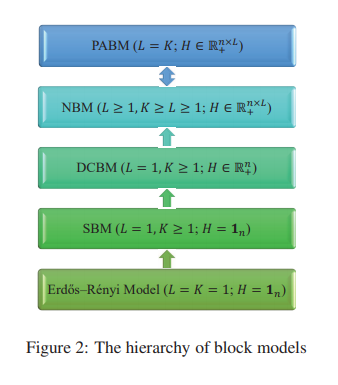

```{r setup, include=FALSE}
knitr::opts_chunk$set(echo = FALSE, 
                      comment = NA, 
                      warning = FALSE, 
                      message = FALSE,
                      fig.align = 'center',
                      fig.lp = '')
options(xtable.comment = FALSE, 
        xtable.table.placement = 'H')
library(ggplot2)
import::from(magrittr, `%>%`)
theme_set(theme_bw())

source('~/dev/pabm-grdpg/functions.R')
set.seed(314159)
```

## {.plain}

\center

\LARGE

\textcolor{darkred}{Community Detection Methods for the Generalized Random Dot Product Graph}

\normalsize

Dissertation Proposal

June 2021

\vspace*{1\baselineskip}

::: columns

:::: {.column width=33%}

John Koo^1^  
*PhD Candidate*

::::

:::: {.column width=33%}

*Research Committee*  
Dr. Michael Trosset^1^  
Dr. Minh Tang^2^  
Dr. Julia Fukuyama^1^  
Dr. Roni Khardon^3^  
Dr. Fangzheng Xie^1^

::::

:::

\vspace*{1\baselineskip}

\tiny 

^1^Department of Statistics, Indiana University  
^2^Department of Statistics, North Carolina State University  
^3^Department of Computer Science, Indiana University

\normalsize

## Community Detection for Networks

\newcommand{\diag}{\text{diag}}
\newcommand{\tr}{\text{Tr}}
\newcommand{\blockdiag}{\text{blockdiag}}
\newcommand{\indep}{\stackrel{\text{ind}}{\sim}}
\newcommand{\iid}{\stackrel{\text{iid}}{\sim}}
\newcommand{\Bernoulli}{\text{Bernoulli}}
\newcommand{\Betadist}{\text{Beta}}
\newcommand{\BG}{\text{BernoulliGraph}}
\newcommand{\Cat}{\text{Categorical}}
\newcommand{\Uniform}{\text{Uniform}}
\newcommand{\RDPG}{\text{RDPG}}
\newcommand{\GRDPG}{\text{GRDPG}}
\newcommand{\PABM}{\text{PABM}}

```{r out.width = '50%', fig.height = 3, fig.width = 4}
Pz <- generate.P.beta(64, 4, 4, 1, 1, 4)
P <- Pz$P
z <- Pz$clustering
A <- draw.graph(P)
qgraph::qgraph(A, groups = factor(z), legend = FALSE)
```

How can we cluster the nodes of a network?

Statistical inference (parametric approach):

1. Define a generative model for graph
$G \mid z_1, ..., z_n, \vec{\theta} \sim P(\vec{z}, \vec{\theta})$.
2. Develop a method for obtaining estimators $f(G) = \hat{z}_1, ..., \hat{z}_n$.
3. Identify asymptotic properties of estimators.

## Overview

1. Probability Models for Networks
    a. Block Models and Community Structure
    b. (Generalized) Random Dot Product Graphs
    c. Connecting Block Models to the (G)RDPG

\vspace*{.5\baselineskip}

2. Popularity Adjusted Block Model
    a. Connecting the PABM to the GRDPG
    b. Orthogonal Spectral Clustering
    c. Sparse Subspace Clustering

\vspace*{.5\baselineskip}

3. Community Detection for the (G)RDPG
    a. Manifold Clustering
    b. Manifolds as (G)RDPG Latent Configurations

# Probability Models for Networks

## Bernoulli Graphs

<style type="text/css">
.caption {
    font-size: x-small;
}
</style>

::: columns

:::: {.column width=62.5%}

Let $G = (V, E)$ be an undirected and unweighted graph with $|V| = n$.

$G$ is described by adjacency matrix $A$ such that
$A_{ij} = \begin{cases} 
1 & \exists \text{ edge between } i \text{ and } j \\
0 & \text{else}
\end{cases}$

$A_{ji} = A_{ij}$ and $A_{ii} = 0$ $\forall i, j \in [n]$.

\vspace*{1\baselineskip}

$A \sim \BG(P)$ iff:

1. $P \in [0, 1]^{n \times n}$ describes edge probabilities between pairs of 
vertices.
2. $A_{ij} \indep \Bernoulli(P_{ij})$ for each $i < j$.

::::

:::: {.column width=37.5%}

**Example 1**: If every entry $P_{ij} = \theta$, then $A \sim \BG(P)$ is an Erdos-Renyi graph.  
For this model, $A_{ij} \iid \Bernoulli(\theta)$.

```{r, fig.height = 2, fig.width = 2}
n <- 2 ** 5
p <- 1 / log(n)
P <- matrix(p, nrow = n, ncol = n)
A <- draw.graph(P)
qgraph::qgraph(A, vsize = 4)
```

::::

:::

## Block Models

Suppose each vertex $v_1, ..., v_n$ has hidden labels $z_1, ..., z_n \in [K]$,  
and each $P_{ij}$ depends on labels $z_i$ and $z_j$.  
Then $A \sim \BG(P)$ is a *block model*.

**Example 2**: Stochastic Block Model with two communities

::: columns

:::: column

* $z_1, ..., z_n \in \{1, 2\}$
* $P_{ij} = \begin{cases} 
p & z_i = z_j = 1 \\
q & z_i = z_j = 2 \\
r & z_i \neq z_j
\end{cases}$

* To make this an assortative SBM, set $p q > r^2$.
* In this example, $p = 1/2$, $q = 1/4$, and $r = 1/8$.

::::

:::: column

```{r, fig.height = 3, fig.width = 4, out.width = '100%'}
n1 <- 2 ** 5
n2 <- 2 ** 5
n <- n1 + n2
z <- c(rep(1, n1), rep(2, n2))
p <- 1/2
q <- 1/4
r <- 1/8
P <- matrix(r, nrow = n, ncol = n)
P[seq(n1), seq(n1)] <- p
P[seq(n1 + 1, n), seq(n1 + 1, n)] <- q
A <- draw.graph(P)
qgraph::qgraph(A, vsize = 4, groups = factor(z), legend = FALSE)
```

::::

:::
  
## Block Models

Erdos-Renyi Model (1959)

* $P_{ij} = \theta$ (not a block model)
* 1 parameter $\theta$

Stochastic Block Model (Lorrain and White, 1971)

* $P_{ij} = \theta_{z_i z_j}$
* $K (K + 1) / 2$ parameters $\theta_{kl}$

Degree Corrected Block Model (Karrer and Newman, 2011)

* $P_{ij} = \theta_{z_i z_j} \omega_i \omega_j$
* $K (K + 1) / 2 + n$ parameters $\theta_{kl}$, $\omega_i$

Popularity Adjusted Block Model (Sengupta and Chen, 2017)

* $P_{ij} = \lambda_{i z_j} \lambda_{j z_i}$
* $K n$ parameters $\lambda_{ik}$
  
## Hierarchy of Block Models

PABM $\to$ DCBM: $\lambda_{ik} = \sqrt{\theta_{z_i k}} \omega_i$

DCBM $\to$ SBM: $\omega_i = 1$

SBM $\to$ Erdos-Renyi: $\theta_{kl} = \theta$

\begin{center}
```{r, out.width = '125px'}

```

\tiny{Majid Noroozi and Marianna Pensky, 2021}
\end{center}

## (Generalized) Random Dot Product Graph Model

Random Dot Product Graph $A \sim \RDPG(X)$  
(Young and Scheinerman, 2007)

* Latent vectors $x_1, ..., x_n \in \mathbb{R}^d$ such that 
$x_i^\top x_j \in [0, 1]$
* $A \sim \BG(X X^\top)$ where 
$X = \begin{bmatrix} x_1 & \cdots & x_n \end{bmatrix}^\top$

Generalized Random Dot Product Graph $A \sim \GRDPG_{p, q}(X)$  
(Rubin-Delanchy, Cape, Tang, Priebe, 2020)

* Latent vectors $x_1, ..., x_n \in \mathbb{R}^{p+q}$ such that 
$x_i^\top I_{p, q} x_j \in [0, 1]$ and $I_{p, q} = \blockdiag(I_p, -I_q)$
* $A \sim \BG(X I_{p, q} X^\top)$ where 
$X = \begin{bmatrix} x_1 & \cdots & x_n \end{bmatrix}^\top$

If latent vectors $X_1, ..., X_n \iid F$, then we write 
$(A, X) \sim \RDPG(F, n)$ or $(A, X) \sim \GRDPG_{p, q}(F, n)$.

## (Generalized) Random Dot Product Graph Model

### Recovery/Estimation

Want to estimate $X$ from $A$, or alternatively, 
interpoint distances, inner products, or angles.

### Adjacency Spectral Embedding

To embed in $\mathbb{R}^d$, 

1. Compute $A \approx \hat{V} \hat{\Lambda} \hat{V}^\top$ 
where $\hat{\Lambda} \in \mathbb{R}^{d \times d}$ and 
$\hat{V} \in \mathbb{R}^{n \times d}$.  
For RDPG, use $d$ greatest eigenvalues; 
for GRDPG, use $p$ most positive and $q$ most negative eigenvalues.

2. For RDPG, let $\hat{X} = \hat{V} \hat{\Lambda}^{1/2}$; 
for GRDPG, let $\hat{X} = \hat{V} |\hat{\Lambda}|^{1/2}$.

\vspace*{.5\baselineskip}

RDPG: $\max\limits_i \|\hat{X}_i - W_n X_i \| \stackrel{a.s.}{\to} 0$
(Athreya et al., 2018)  
GRDPG: 
$\max\limits_i \|\hat{X}_i - Q_n X_i \| \stackrel{a.s.}{\to} 0$
(Rubin-Delanchy et al., 2020)

## Connecting Block Models to the (G)RDPG Model

All Bernoulli Graphs are RDPG (if $P$ is 
positive semidefinite)  
or GRDPG (in general).

**Example 2** (cont'd): Assortative SBM ($p q > r^2$) with $K = 2$

::: columns

:::: column

$$P_{ij} = \begin{cases} 
p & z_i = z_j = 1 \\
q & z_i = z_j = 2 \\
r & z_i \neq z_j
\end{cases}$$

```{r fig.height = 3, fig.width = 6, out.width = '100%'}
qgraph::qgraph(A, vsize = 4, groups = factor(z), legend = FALSE)
```

::::

:::: column

$$P = 
\begin{bmatrix} 
P^{(11)} & P^{(12)} \\
P^{(21)} & P^{(22)}
\end{bmatrix} =
X X^\top$$

$$X = \begin{bmatrix} 
\sqrt{p} & 0 \\
\vdots & \vdots \\
\sqrt{p} & 0 \\
\sqrt{r^2 / p} & \sqrt{q - r^2 / p} \\
\vdots & \vdots \\
\sqrt{r^2 / p} & \sqrt{q - r^2 / p}
\end{bmatrix}$$

::::

:::

## Connecting Block Models to the (G)RDPG Model

**Example 2** (cont'd): If we want to perform community detection, 

1. Note that $A$ is a RDPG because $P = X X^\top$.
2. Compute the ASE $A \approx \hat{X} \hat{X}^\top$ with 
$\hat{X} = \hat{V} \hat{\Lambda}^{1/2}$.
3. Apply clustering algorithm (e.g., $K$-means) to $\hat{X}$,  
noting that as $n \to \infty$, the ASE approaches point masses.

```{r, fig.height = 5, fig.width = 5, out.width = '50%'}
P.eigen = eigen(P)
X <- P.eigen$vectors[, 1:2] %*% diag(P.eigen$values[1:2] ** .5)

A.eigen <- eigen(A)
X.hat <- A.eigen$vectors[, 1:2] %*% diag(A.eigen$values[1:2] ** .5)
plot(X.hat, asp = 1, col = z * 2, xlab = NA, ylab = NA, 
     main = 'ASE of the adjacency matrix drawn from SBM')
points(X, pch = 16, col = z * 2)
```

## Connecting Block Models to the (G)RDPG Model

::: columns

:::: column

```{r, out.width = '50%', fig.height = 2.5, fig.width = 2.5}
par(mar = rep(1.75, 4))
plot(X, asp = 1, col = z, xlab = NA, ylab = NA, main = 'SBM: Point masses')
```

\vspace*{.5\baselineskip}

```{r, out.width = '50%', fig.height = 2.5, fig.width = 2.5}
par(mar = rep(1.75, 4))
omega <- rbeta(n, 1, 1)
dc.matrix <- omega %*% t(omega)
P.dcbm <- P * dc.matrix
dcbm.eigen <- eigen(P.dcbm)
X.dcbm <- dcbm.eigen$vectors[, 1:2] %*% diag(dcbm.eigen$values[1:2] ** .5)
plot(X.dcbm, asp = 1, col = z, xlab = NA, ylab = NA, main = 'DCBM: Rays')

```

::::

:::: column

\vspace*{0\baselineskip}

```{r, out.width = '100%', fig.height = 4, fig.width = 4}
par(mar = rep(1.75, 4))
Pz <- generate.P.beta(n * 10)
P <- Pz$P
z <- Pz$clustering
X <- embedding(P)
pairs(X, col = z, asp = 1, pch = '.', main = 'PABM: Orthogonal subspaces')
```

::::

:::

# Popularity Adjusted Block Model

## Popularity Adjusted Block Model

**Def** Popularity Adjusted Block Model (Sengupta and Chen, 2017):

Let each vertex $i \in [n]$ have $K$ popularity parameters
$\lambda_{i1}, ..., \lambda_{iK} \in [0, 1]$. 
Then $A \sim \PABM(P)$ if each $P_{ij} = \lambda_{i z_j} \lambda_{j z_i}$,  
e.g., if $z_i = k$ and $z_j = l$, $P_{ij} = \lambda_{il} \lambda_{jk}$.

**Lemma** (Noroozi, Rimal, and Pensky, 2020): 

$A$ is sampled from a PABM if $P$ can be described as:

1. Let each $P^{(kl)}$ denote the $n_k \times n_l$ matrix of edge probabilities 
between communities $k$ and $l$. 
2. Organize popularity parameters as vectors 
$\lambda^{(kl)} \in \mathbb{R}^{n_k}$ 
such that $\lambda^{(kl)}_i = \lambda_{k_i l}$ is the popularity parameter 
of the $i$^th^ vertex of community $k$ towards community $l$. 
3. Each block can be decomposed as 
$P^{(kl)} = \lambda^{(kl)} (\lambda^{(lk)})^\top$.

**Notation**: $A \sim \PABM(\{\lambda^{(kl)}\}_K)$.

## Connecting the PABM to the GRDPG

**Theorem** (KTT): $A \sim \PABM(\{\lambda^{(kl)}\}_K)$ is equivalent to 
$A \sim \GRDPG_{p, q}(X U)$ with

* $p = K (K + 1) / 2$, $q = K (K - 1) / 2$
* $U \in \mathbb{O}(K^2)$
* $X \in \mathbb{R}^{n \times K^2}$ is block diagonal and 
composed of $\{\lambda^{(kl)}\}_K$ 
with each block corresponding to a community.  

$$X = \begin{bmatrix}
\Lambda^{(1)} & \cdots & 0 \\
0 & \ddots & 0 \\
0 & \cdots & \Lambda^{(K)}
\end{bmatrix} 
\in \mathbb{R}^{n \times K^2}$$

$$\Lambda^{(k)} = \begin{bmatrix} 
\lambda^{(k1)} & \cdots & \lambda^{(kK)} 
\end{bmatrix} 
\in \mathbb{R}^{n_k \times K}$$

## Connecting the PABM to the GRDPG

::: columns

:::: column

$$X = \begin{bmatrix}
\Lambda^{(1)} & \cdots & 0 \\
0 & \ddots & 0 \\
0 & \cdots & \Lambda^{(K)}
\end{bmatrix}$$

::::

:::: column

\vspace*{2\baselineskip}

$$U \in \mathbb{O}(K^2)$$

::::

:::

$$A \sim \PABM(\{\lambda^{(kl)}\}_K) \iff A \sim \GRDPG_{p, q}(X U)$$

**Remark 1** (orthogonality of subspaces):
If $y_i^\top$ and $y_j^\top$ are two rows of $X U$ corresponding 
to different communities, then $y_i^\top y_j = 0$.

**Remark 2** (non-uniqueness of the latent configuration):  
If $A \sim \GRDPG_{p, q}(Y)$, then $A \sim \GRDPG_{p, q}(Y Q)$ for any $Q$ in 
the indefinite orthogonal group with signature $p, q$.

**Remark 3**: Communities correspond to subspaces even with linear transformation $Q \in \mathbb{O}(p, q)$, but this may break the orthogonality property.

## Orthogonal Spectral Clustering

**Theorem** (KTT): 
If $P = V \Lambda V^\top$ and $B = n V V^\top$,  
then $B_{ij} = 0$ if $z_i \neq z_j$.

**Algorithm**: Orthogonal Spectral Clustering:

1. Let $V$ be the eigenvectors of $A$ corresponding to the $K (K+1)/2$ most 
positive and $K (K-1) / 2$ most negative eigenvalues.
2. Compute $B = |n V V^\top|$ applying $|\cdot|$ entry-wise.
3. Construct graph $G$ using $B$ as its similarity matrix.
4. Partition $G$ into $K$ disconnected subgraphs.

**Theorem** (KTT): 
Let $\hat{B}_n$ with entries $\hat{B}_n^{(ij)}$ be the affinity matrix from OSC. 
Then $\forall$ pairs $(i, j)$ belonging to different communities 
and sparsity factor satisfying $n \rho_n = \omega\big((\log n)^{4c}\big)$, 

$$
\max_{i, j} \hat{B}^{(ij)}_n = 
O_P \Big( \frac{(\log n)^c}{\sqrt{n \rho_n}} \Big)
$$

## Sparse Subspace Clustering

**Corollary**: The ASE of $A \sim \PABM(\{\lambda^{(kl)}\}_K)$ lies near a collection of $K$-dimensional subspaces in $K^2$ dimensions.

**Algorithm**: Sparse Subspace Clustering (Elhamifar & Vidal, 2009):

1. Solve $n$ optimization problems $c_i = \arg\min_c \|c\|_1$ 
subject to $x_i = X^\top c$ and $c^{(i)} = 0$.  
This is typically performed via LASSO: 
$c_i = \arg\min \frac{1}{2} \|x_i - X_{-i}^\top c\|_2^2 + \lambda \|c\|_1$
2. Compile solutions $C = \begin{bmatrix} c_1 & \cdots & c_n \end{bmatrix}$.
3. Construct affinity matrix $B = |C| + |C^\top|$.

## Sparse Subspace Clustering

Noroozi et al. observed that the rank of $P$ is $K^2$ 
and the columns of $P$ belonging to each community has rank $K$ 
to justify SSC for the PABM.

$$c_i = \arg\min_{c} \|c\|_1 \text{ subject to } A_{\cdot, i} = A c
\text{ and } c^{(i)} = 0$$

They were able to show that this obeys SDP if we replace $A$ with $P$.

GRDPG-based approach: Apply SSC to the ASE of $A$.

Stronger result: Apply SSC to the eigenvectors of $A$.

$$c_i = \arg\min_{c} \|c\|_1 \text{ subject to } 
\hat{v}_i = \hat{V}^\top c \text{ and } c^{(i)} = 0$$
$$A \approx \hat{V} \hat{\Lambda} \hat{V}^\top$$

## Sparse Subspace Clustering

**Theorem** (KTT): 

Let 

* $P_n$ describe the edge probability matrix of the PABM with $n$ vertices, and 
$A_n \sim \BG(P_n)$;
* $\hat{V}_n$ be the matrix of eigenvectors of $A_n$ corresponding to the 
$K (K + 1) / 2$ most positive and $K (K - 1) / 2$ most negative eigenvalues. 

Then 

* For some $\lambda > 0$ and $N < \infty$, $\sqrt{n} \hat{V}_n$ obeys the Subspace Detection Property with probability 1 when $n > N$.

Remarks:

* For large $n$, we can identify $\lambda$ for SDP (Wang and Xu, 2016).
* SDP does not guarantee community detection.

## Simulation Study

```{r clust_err_k, fig.width = 10, fig.height = 3, out.width = '100%'}
setwd('~/dev/pabm-grdpg')
clustering.df <- readr::read_csv('clustering-k.csv')
ssc.df <- readr::read_csv('clustering-ssc-k.csv')
clustering.df %>%
  dplyr::group_by(n, K) %>%
  dplyr::summarise(
    med.err = median(error),
    first.q = quantile(error, .25),
    third.q = quantile(error, .75),
    med.err.ssc = median(error.ssc),
    first.q.ssc = quantile(error.ssc, .25),
    third.q.ssc = quantile(error.ssc, .75),
    med.err.ep = median(error.ep, na.rm = TRUE),
    first.q.ep = quantile(error.ep, .25, na.rm = TRUE),
    third.q.ep = quantile(error.ep, .75, na.rm = TRUE),
    med.err.louvain = median(error.louvain),
    first.q.louvain = quantile(error.louvain, .25),
    third.q.louvain = quantile(error.louvain, .75)
  ) %>% 
  dplyr::ungroup() %>% 
  dplyr::inner_join(
    ssc.df %>% 
      dplyr::group_by(n, K) %>% 
      dplyr::summarise(med.err.ssc2 = median(error.ssc2),
                       first.q.ssc2 = quantile(error.ssc2, .25),
                       third.q.ssc2 = quantile(error.ssc2, .75)) %>% 
      dplyr::ungroup()
  ) %>% 
  ggplot() +
  scale_x_log10(breaks = c(128, 256, 512, 1024, 2048, 4096)) +
  # scale_x_continuous(breaks = c(128, 256, 512, 1024, 2048, 4096)) + 
  scale_y_log10() +
  labs(y = 'community detection error rate', 
       colour = NULL) +
  geom_line(aes(x = n, y = med.err,
                colour = 'OSC')) +
  geom_errorbar(aes(x = n, ymin = first.q, ymax = third.q,
                    colour = 'OSC'), width = .1) + 
  geom_line(aes(x = n, y = med.err.ssc,
                colour = 'SSC-ASE')) + 
  geom_errorbar(aes(x = n, ymin = first.q.ssc, ymax = third.q.ssc,
                    colour = 'SSC-ASE'), width = .1) + 
  # geom_line(aes(x = n, y = med.err.ep,
  #               colour = 'MM-EP')) + 
  # geom_errorbar(aes(x = n, ymin = first.q.ep, ymax = third.q.ep,
  #                   colour = 'MM-EP'), width = .1) + 
  geom_line(aes(x = n, y = med.err.ssc2,
                colour = 'SSC-A')) + 
  geom_errorbar(aes(x = n, ymin = first.q.ssc2, ymax = third.q.ssc2,
                    colour = 'SSC-A'), width = .1) + 
  # geom_line(aes(x = n, y = med.err.louvain,
  #               colour = 'MM-Louvain')) + 
  # geom_errorbar(aes(x = n, ymin = first.q.louvain, ymax = third.q.louvain,
  #                   colour = 'MM-Louvain'), width = .1) + 
  scale_colour_brewer(palette = 'Set1') + 
  facet_wrap(~ K, labeller = 'label_both')
```

# General Community Detection for the (G)RDPG

## Recovery from the Adjacency Matrix

```{r}
n1 <- 2 ** 5
n2 <- 2 ** 5
n <- n1 + n2
z <- c(rep(1, n1), rep(2, n2))
u1 <- runif(n1)
u2 <- runif(n2)
x1 <- cos(pi / 3 * u1)
y1 <- sin(pi / 3 * u1)
x2 <- 1 + cos(pi / 3 * u2 + pi)
y2 <- 1 + sin(pi / 3 * u2 + pi)
data.matrix <- cbind(c(x1, x2), c(y1, y2))
```

::: columns

:::: {.column width=33%}

```{r, fig.height = 3, fig.width = 4, out.width = '100%'}
par(mar = rep(1, 4))
plot(data.matrix, col = z * 2, asp = 1, xlab = NA, ylab = NA,
     main = 'Latent configuration')
```

::::

:::: {.column width=33%}

```{r, fig.height = 3, fig.width = 4, out.width = '100%'}
par(mar = rep(1, 4))
P <- data.matrix %*% diag(c(1, 1)) %*% t(data.matrix)
A <- draw.graph(P)
qgraph::qgraph(A, groups = factor(z), layout = 'spring', legend = FALSE)
title('(G)RDPG')
```

::::

:::: {.column width=33%}

```{r, fig.height = 3, fig.width = 4, out.width = '100%'}
par(mar = rep(1, 4))
A.eigen <- eigen(A)
Xhat <- A.eigen$vectors[, c(1, 2)] %*% diag(sqrt(abs(A.eigen$values[c(1, 2)])))
plot(Xhat, col = z * 2, asp = 1, main = 'ASE')
```

::::

:::

## Generative Model

Let $(A, X) \sim \GRDPG_{p, q}(F, n)$ as follows:

1. Define functions $\gamma_1, ..., \gamma_K$ such that each 
$\gamma_k : [0, 1]^r \mapsto \mathbb{R}^d$ and $\gamma_k(t) \neq \gamma_l(t)$ 
when $k \neq l$.
2. Sample labels
$Z_1, ..., Z_n \iid \Cat(\pi_1, ..., \pi_K)$.
3. Sample $T_1, ..., T_n \iid D$ with support $[0, 1]^r$. 
4. Set latent positions $X_i = \gamma_{Z_i}(T_i)$ and 
$X = \begin{bmatrix} X_1 & \cdots & X_n \end{bmatrix}^\top$.
5. $A \sim \BG(X I_{p, q} X^\top)$

## Community Detection

Recall that the ASE approximates the true latent positions:

$$\max_i \|\hat{X}_i - Q_n X_i\| \stackrel{a.s.}{\to} 0$$

This suggests a general approach to community detection:

Given $A$, $K$, and $d$ (or $p$ and $q$), 

  1. Use ASE to approximate the latent configuration.
  
  2. Use an appropriate clustering algorithm for the latent configuration.
  
## Parallel Segments

**Example 3**: 
Let $U_1, ..., U_{n_1}, U_{n_1 + 1}, ..., U_{n} \iid \Uniform(0, \theta)$, $\gamma_1(t) = (t, 0)$, and $\gamma_2(t) = (t, a)$. $X_i = \gamma_1(U_i)$ for $i \leq n_1$ and $X_j = \gamma_2(U_j)$ for $n_1 + 1 \leq j \leq n$.  
If we observe $X_1, ..., X_{n_1}, X_{n_1+1}, ..., X_{n}$, what approach will allow us to group the observations by segment?

```{r fig.height = 3, out.width = '50%'}
set.seed(123456)

n1 <- 2 ** 5
n2 <- 2 ** 5
n <- n1 + n2

a <- .1

X <- cbind(runif(n1, 0, cos(pi / 2 * a)), rep(0, n1))
Y <- cbind(runif(n2, 0, cos(pi / 2 * a)), rep(a, n2))

data.matrix <- rbind(X, Y)
z <- c(rep(1, n1), rep(2, n2))

as.data.frame(data.matrix) %>% 
  dplyr::mutate(label = factor(z)) %>% 
  ggplot() + 
  geom_segment(aes(x = 0, xend = cos(pi / 2 * a), y = 0, yend = 0), size = .1) + 
  geom_segment(aes(x = 0, xend = cos(pi / 2 * a), y = a, yend = a), size = .1) + 
  geom_point(aes(x = V1, y = V2, colour = label)) + 
  labs(x = NULL, y = NULL, colour = NULL) + 
  guides(colour = FALSE) + 
  xlim(-.1, cos(pi / 2 * a) + .1) + 
  ylim(-a, 2 * a) + 
  scale_colour_brewer(palette = 'Set1') + 
  # coord_fixed() + 
  # ggthemes::theme_few() + 
  theme_void() + 
  theme(axis.text = element_blank(),
        axis.ticks = element_blank())
```

Then for any $a \in (0, 1)$, $\delta \in (0, 1)$, 
we can find $N(a, \delta) < \infty$ such that when $\min_k n_k \geq N$, 
with probability at least $1 - \delta$,

1. Single linkage clustering entails perfect community detection.

2. Any $\epsilon$-neighborhood graph with $\epsilon \leq a$ will consist of 
at least $K$ disjoint subgraphs such that no subgraph contains members of two 
different communities.

## Noisy Parallel Segments and One-Dimensional Manifolds

**Example 4**: 
Starting with the parallel segments as before, suppose instead of observing $X_1, ..., X_n$, we have noisy observations $X_1 + \xi_1, ..., X_n + \xi_n$ such that 
$\max_i \|\xi_i\| = \xi \leq a / 3$.

```{r fig.height = 3, out.width = '50%'}
# xi1 <- runif(n, -a / 6 / sqrt(2), a / 6 / sqrt(2))
xi1 <- rep(0, n)
xi2 <- runif(n, -a / 6 / sqrt(2), a / 6 / sqrt(2))

as.data.frame(data.matrix) %>% 
  dplyr::mutate(V1 = V1 + xi1, V2 = V2 + xi2) %>% 
  dplyr::mutate(label = factor(z)) %>% 
  ggplot() + 
  geom_segment(aes(x = 0, xend = cos(pi / 2 * a), y = 0, yend = 0), size = .1) + 
  geom_segment(aes(x = 0, xend = cos(pi / 2 * a), y = a, yend = a), size = .1) + 
  geom_point(aes(x = V1, y = V2, colour = label)) + 
  labs(x = NULL, y = NULL, colour = NULL) + 
  guides(colour = FALSE) + 
  xlim(-.1, cos(pi / 2 * a) + .1) + 
  ylim(-a, 2 * a) + 
  scale_colour_brewer(palette = 'Set1') + 
  # coord_fixed() + 
  # ggthemes::theme_few() + 
  theme_void() + 
  theme(axis.text = element_blank(),
        axis.ticks = element_blank())
```

Then we can derive similar statements as in Example 3. 

This also holds for noisy points sampled uniformly on one-dimensional manifolds such that the manifolds are distance at least $a$ apart.

Since the ASE of a RDPG generated from points on these segments/curves will reconstruct the original segments/curves with noise, we can apply this to the RDPG (if sufficient $n$).

## Future Work

1. Derive formal statements showing that the ASE of a random graph generated by these latent configurations produces the correct conditions for community detection.

2. Extend results to non-uniform distributions.

3. Extend results to multidimensional manifolds.

4. Relax condition for the minimum distance between manifolds.

5. Extend results to the GRDPG.

# Thank you

# Additional Slides

## Subspace Detection Property

If $X$ obeys the *Subspace Detection Property*, then $B$ is sparse such that 
$B_{ij} = 0$ for each $x_i$ and $x_j$ belonging to different subspaces.

::: columns

:::: column

```{r, fig.height = 3, fig.width = 4, out.width = '50%'}
set.seed(314159)

par(mar = rep(1, 4))

x1 <- runif(n, 1 / sqrt(50), 1)
y1 <- rep(0, n)
x2 <- rep(0, n)
y2 <- x1
z <- c(rep(1, n), rep(2, n))
X <- cbind(c(x1, x2), c(y1, y2))
X <- X + cbind(runif(n * 2, 0, .025),
               runif(n * 2, 0, .025))
X <- X %*% rbind(c(cos(pi / 9), sin(pi / 9)),
                 c(-sin(pi/ 9), cos(pi / 9)))
plot(X, col = z * 2, asp = 1, xlab = NA, ylab = NA)
```

::::

:::: column

```{r, fig.height = 3, fig.width = 5, out.width = '75%'}
Y <- t(X)
Y <- sweep(Y, 2, apply(Y, 2, function(y) sqrt(sum(y ** 2))), `/`)
Y[is.nan(Y)] <- 0
lambda <- .05
N <- ncol(Y)
B <- plyr::aaply(seq(N), 1, function(i) {
  y <- Y[, i]
  X <- Y[, -i]
  betahat <- glmnet::glmnet(X, y, lambda = lambda, intercept = FALSE) %>% 
    coef() %>% 
    as.numeric()
  if (i != N) {
    betahat <- c(betahat[seq(i)], 0, betahat[seq(i + 1, N)])
  } else {
    betahat <- c(betahat, 0)
  }
  betahat <- betahat[-1]
  return(betahat)
}, .parallel = TRUE) %>% 
  abs()
B <- sweep(B, 2, apply(B, 2, max), `/`)
B[is.nan(B)] <- 0
W <- B + t(B)

qgraph::qgraph(sign(W), layout = 'spring', groups = factor(z), legend = FALSE)
```

::::

:::

**Theorem** (Wang and Xu, 2016): 
If data matrix $X$ consists of points lying close to 
low-dimensional subspaces such that:

1. Each point's distance to its subspace is sufficiently small.
2. The points corresponding to each subspace cover a sufficient amount of 
that subspace.
3. The cosine of the angles between pairs of subspaces is sufficiently small.

Then $X$ obeys SDP.

## Parameter Estimation

1. Let $A^{(kl)}$ be the block of edges between communities $k$ and $l$. 
2. For each $k, l \in [K]$, do:
    i. Compute the SVD $A^{(kl)} = U \Sigma V^\top$.
    ii. Assign $u^{(kl)}$ and $v^{(kl)}$ as the first columns of $U$ and $V$. 
    Assign $\sigma^{(kl)} \leftarrow \Sigma_{11}^{1/2}$. 
    iii. Assign $\hat{\lambda}^{(kl)} \leftarrow \pm \sigma^{(kl)} u^{(kl)}$ and 
    $\hat{\lambda}^{(kl)} \leftarrow \pm \sigma^{(kl)} v^{(kl)}$.

**Theorem** (KTT): 

$$\max_{k, l} \|\hat{\lambda}^{(kl)} - \lambda^{(kl)}\| =
O_P \Big( \frac{(\log n_k)^c}{\sqrt{n_k}} \Big)$$

## Indefinite Orthogonal Group

$$\mathbb{O}(p, q) = \{Q : Q I_{p, q} Q^\top = I_{p, q}\}$$

* $Q^\top Q \neq I$
* If $A \sim \GRDPG_{p, q}(X)$, then $A \sim \GRDPG_{p, q}(X Q)$
* $(Q x)^\top (Q y) = x^\top Q^\top Q y \neq x^\top y$
* $\|Q\| \neq 1$ $\implies$ $\|Q x - Q y\| \neq \|x - y\|$

## Non-Spectral Community Detection for Block Models

Likelihood

$$L = \prod_{i<j} \prod_{k, l}^K 
\big(p_{k, l, i, j}^{A_{ij}} 
(1 - p_{k, l, i, j})^{1 - A_{ij}} \big)^{z_{ik} z_{jl}}$$

Example: DCBM ($p_{k, l, i, j} = \theta_{kl} \omega_i \omega_j$)

$$L = \prod_{i<j} \prod_{k, l}^K 
\big((\theta_{kl} \omega_i \omega_j)^{A_{ij}} 
(1 - \theta_{kl} \omega_i \omega_j)^{1 - A_{ij}} \big)^{z_{ik} z_{jl}}$$

* ML method for community detection: $\hat{\vec{z}} = \arg\max_{\vec{z}} L$

* NP-complete
  * Expectation-Maximization
  * Bayesian methods
  * Spectral methods

## Expectation Maximization for the PABM

Full data log-likelihood

$$\begin{split}
\log L = & 
\sum_{i < j} \sum_{k, l} z_{ik} z_{jl} (A_{ij} \log \lambda_{il} \lambda_{jk} +
(1 - A_{ij}) \log(1 - \lambda_{il} \lambda_{jk})) \\
+ & \sum_i \sum_k z_{ik} \log \pi_k
\end{split}$$

E-step

* $\gamma_{ik} = P(Z_i = k \mid \{\pi_l\}, \{\lambda_{jl}\})$
* $\log \gamma_{ik} \propto 
\log \pi_k + 
\sum_{j \neq i} \sum_l \pi_{jl} (A_{ij} \log \lambda_{il} \lambda_{jk} + 
(1 - A_{ij}) \log(1 - \lambda_{il} \lambda_{jk}))$

M-step

* $\pi_k = \frac{1}{n} \sum_i \gamma_{ik}$
* $\{\lambda_{ik}\} = \arg\max_{\{\lambda_{ik}\}} E_Z[\log L]$

## MCMC Sampling for the PABM

Priors:

* $Z_i \iid \Cat(\pi_1, ..., \pi_K)$
* $\lambda_{ik} \indep \Betadist(a_{ik}, b_{ik})$

Full joint distribution:

$$\begin{split}
\log p & = constant \\
& + \sum_{i < j} \sum_k \sum_l z_{ik} z_{jl} 
(A_{ij} \log \lambda_{il} \lambda_{jk} + 
(1 - A_{ij}) \log (1 - \lambda_{il} \lambda_{jk})) \\
& + \sum_k \sum_i z_{ik} \log \pi_k \\
& + \sum_i \sum_k (a_{ik} - 1) \log \lambda_{ik} + (b_{ik} - 1) \log (1 - \lambda_{ik})
\end{split}$$

## Variational Inference for the PABM

Mean Field Variational Inference

* Minimize $d_{KL}(p || q)$
  * $p$ is the joint distribution
  * $q$ is a density of some form
* Restrict 
$q(\vec{z}, \{\lambda_{ik}\}) = 
\Big(\prod_i q_{z_i}(z_i) \Big) \Big(\prod_{i, k} q_{\lambda_{ik}}(\lambda_{ik})\Big)$
* Iterative solution: 
$q_{\theta_i}^{(t+1)} \propto \exp(E_{\theta_{-i}^{(t)}}[\log p])$

* Approximate solution for the PABM
  * $Z_i \mid \{a'_{ik}\}, \{b'_{ik}\} \sim \Cat(\pi'_1, ..., \pi'_K)$
  * $\lambda_{ik} \mid 
  \{a'_{-i, -k}\}, \{b'_{-i, -k}\}, \{\pi'_k\} \sim \Betadist(a'_{ik}, b'_{ik})$
  * Iteratively update $\{\pi'_K\}, \{a'_{ik}\}, \{b'_{ik}\}$ until convergence